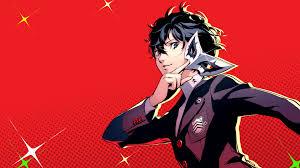

<!DOCTYPE html>
<html>

<head>
<title> Review Persona 5 </title>
<meta charset="UTF-8">
<link rel="stylesheet" type="text/css" href="tengomiedo.css">
<meta name="description" content="Página web que intenta ayudar a las personas a entra al juego Persona 5 y una mini review del juego">
<meta name="author" content="Pedro Úbeda Ruiz">
<meta name="keywords" content="Persona5, ayuda en persona, Tipos de personas">

</head>

<body>
<h2> ¿Que es Persona? </h3>

<table>
<tr>
	<td colspan="2">
 Persona 5 es un videojuego por turnos  de la franquicia  Persona  diseñado  por  ATLUS  en 2017.</td>
	<td colspan="3">

</td>
</tr>
</table>

<h2> ¿De que va este videojuego y que hace que destaque de los demas? </h2>

<table>
	<tr>
		<td> <video width="640" height="320" controls>
		<source src="personavideo.mp4" type="video/mp4">
		</video> </td>
		<td> 
 Este juego es un JRPG en el que 1 adolescente de 16 años se tiene que mudar a Tokyo y como tanto adaptarse a su nueva vida ahí.  
				Y mediante una aplicación de movil debera adentrarse a los corazones de las victimas las cuales suelen ser delicuentes para que  
				acaben confesando los crimenes.  Para mi destaca sobre los demas gracias a su sistema de ataque y a su historia que ha enamorado a muchos jugadores  
 </td>
	</tr>
</table>

<h2> Sistema de combate </h2>

 Persona es un juego por turnos y como juego por turnos tiene su propia tabla de tipos 

<table style="border:5px solid white; border-spacing:15px; margin-right:auto">
	<tr>
		<td colspan="2"> 
 Imagen 

		<td colspan="3"> 
 Elemento 

		<td colspan="3"> 
 Debilidad 

	</tr>
	<tr>
		<td colspan="2">  </td>
		<td colspan="3"> 
 Fuego 
 </td>
		<td colspan="3"> 
 Hielo 
 </td>
	</tr>
	<tr>
		<td colspan="2">  </td>
		<td colspan="3"> 
 Hielo 
 </td>
		<td colspan="3"> 
 Fuego 
 </td>
	</tr>
	<tr>
		<td colspan="2">  </td>
		<td colspan="3"> 
 Rayo 
 </td>
		<td colspan="3"> 
 Viento 
 </td>
	</tr>
	<tr>
		<td colspan="2">  </td>
		<td colspan="3"> 
 Viento 
 </td>
		<td colspan="3"> 
 Rayo 
 </td>
	</tr>
	<tr>
		<td colspan="2">  </td>
		<td colspan="3"> 
 Psíquico 
 </td>
		<td colspan="3"> 
 N/A 
 </td>
	</tr>
	<tr>
		<td colspan="2">  </td>
		<td colspan="3"> 
 Nuclear 
 </td>
		<td colspan="3"> 
 Dependiendo del persona 
 </td>
	</tr>
	<tr>
		<td colspan="2">  </td>
		<td colspan="3"> 
 Luz 
 </td>
		<td colspan="3"> 
 Oscuridad 
 </td>
	</tr>
	<tr>
		<td colspan="2">  </td>
		<td colspan="3"> 
 Oscuridad 
 </td>
		<td colspan="3"> 
 Luz 
 </td>
	</tr>
</table>

 Y esto es el combate a magia también existe el ataque rápido  y el físico que pueden meter  crítico   permitiendote hacer un  UNO MÁS  el cual te multiplica el daño por eso siempre busca las debilidades de cada enemigo. 

<h2> Banda Sonora </h2>

 La banda sonora de este videojuego es de las mejores que escuchado la artista Lyn la cual es la cantante de todas las canciones de este juego 
y tiene una amplía variedad de tipos de Jazz hasta pop 

<a href="https://open.spotify.com/intl-es/artist/5qEtLvXzYdv0G7c7rR6irX" target="_blank"> 
 
</a>

<h2> Gráficos </h2>

 El apartado gráfico de Persona 5 para la época en que salío y teniendo en cuenta el presupuesto del que optaron son muy buenos y cada vez se comprueba que efectivamente ATLUS le pone empeño como a su ultimo juego el cual fue nominado a GOTY Metaphor Refantazio 

	 	

<h2> Conclusión </h2>

		

 Persona 5 es un increible juego por turnos y es de los mejores que he probado todos sus apartados que tienen los pulé a la perfección  
	en cuanto a banda sonora como al gameplay, para mí un completo 10/10 si te gustan los juegos por turnos 

</body>

</html>
